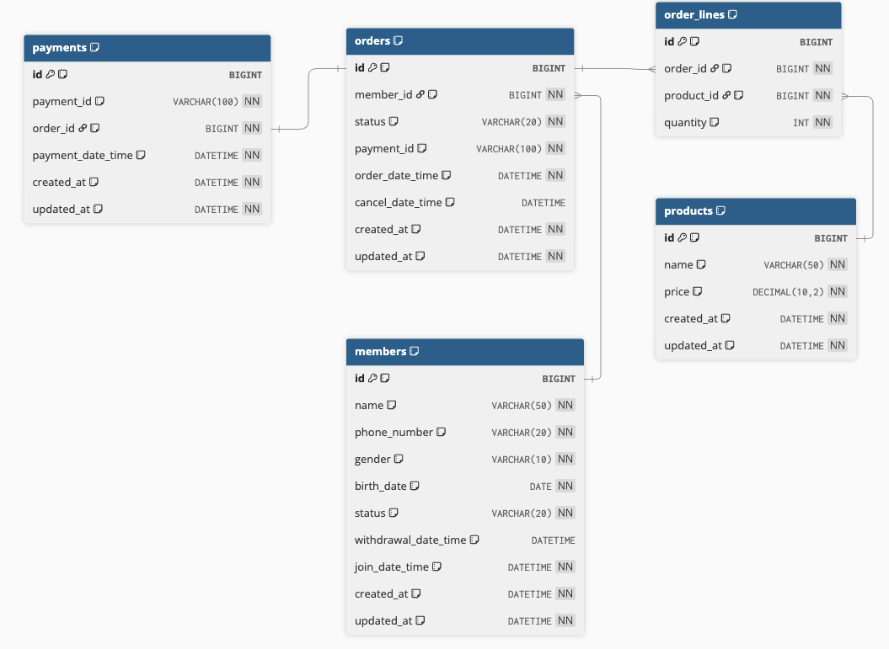

# ERD (Entity Relationship Diagram)

## 시스템 데이터 구조 설계

### ERD 다이어그램

---

## 테이블 상세 설명

### 1. MEMBERS (회원)

회원 정보를 관리하는 테이블입니다.

| 컬럼명 | 타입 | 제약조건 | 설명 |
|--------|------|---------|------|
| id | BIGINT | PK, AUTO_INCREMENT | 회원 고유 ID |
| name | VARCHAR(50) | NOT NULL | 회원 이름 (2-10자) |
| phone_number | VARCHAR(20) | NOT NULL, UNIQUE | 전화번호 (10-11자리) |
| gender | VARCHAR(10) | NOT NULL | 성별 (MALE, FEMALE) |
| birth_date | DATE | NOT NULL | 생년월일 |
| status | VARCHAR(20) | NOT NULL | 회원 상태 (ACTIVE, WITHDRAWN) |
| withdrawal_date_time | DATETIME | NULL | 탈퇴 일시 (탈퇴 시에만 저장) |
| join_date_time | DATETIME | NOT NULL | 가입 일시 |
| created_at | DATETIME | NOT NULL | 생성 일시 (자동) |
| updated_at | DATETIME | NOT NULL | 수정 일시 (자동) |

---

### 2. ORDERS (주문)

주문 정보를 관리하는 테이블입니다.

| 컬럼명 | 타입 | 제약조건 | 설명 |
|--------|------|---------|------|
| id | BIGINT | PK, AUTO_INCREMENT | 주문 고유 ID |
| member_id | BIGINT | NOT NULL, FK | 주문한 회원 ID |
| status | VARCHAR(20) | NOT NULL | 주문 상태 (COMPLETED, CANCELLED) |
| payment_id | VARCHAR(100) | NOT NULL | 결제 ID (외부 결제 시스템) |
| order_date_time | DATETIME | NOT NULL | 주문 일시 |
| cancel_date_time | DATETIME | NULL | 취소 일시 (취소 시에만 저장) |
| created_at | DATETIME | NOT NULL | 생성 일시 (자동) |
| updated_at | DATETIME | NOT NULL | 수정 일시 (자동) |

**관계**:
- MEMBERS (N:1): 한 회원이 여러 주문 가능
- ORDER_LINES (1:N): 한 주문에 여러 상품 포함
- PAYMENTS (1:1): 한 주문당 하나의 결제

---

### 3. ORDER_LINES (주문 상품)

주문에 포함된 상품과 수량을 관리하는 테이블입니다.

| 컬럼명 | 타입 | 제약조건 | 설명 |
|--------|------|---------|------|
| id | BIGINT | PK, AUTO_INCREMENT | 주문상품 고유 ID |
| order_id | BIGINT | NOT NULL, FK | 주문 ID |
| product_id | BIGINT | NOT NULL, FK | 상품 ID |
| quantity | INT | NOT NULL | 주문 수량 |

**관계**:
- ORDERS (N:1): 여러 주문상품이 하나의 주문에 속함
- PRODUCTS (N:1): 여러 주문상품이 하나의 상품 참조

**설계 의도**:
- Order와 Product의 다대다 관계를 해소하는 중간 테이블
- Value Object로 설계 (OrderLine)
- 주문 삭제 시 자동 삭제 (Cascade)

---

### 4. PRODUCTS (상품)

상품 정보를 관리하는 테이블입니다.

| 컬럼명 | 타입 | 제약조건 | 설명 |
|--------|------|---------|------|
| id | BIGINT | PK, AUTO_INCREMENT | 상품 고유 ID |
| name | VARCHAR(50) | NOT NULL | 상품명 |
| price | DECIMAL(10,2) | NOT NULL | 상품 가격 |
| created_at | DATETIME | NOT NULL | 생성 일시 (자동) |
| updated_at | DATETIME | NOT NULL | 수정 일시 (자동) |

---

### 5. PAYMENTS (결제)

결제 정보를 관리하는 테이블입니다.

| 컬럼명 | 타입 | 제약조건 | 설명 |
|--------|------|---------|------|
| id | BIGINT | PK, AUTO_INCREMENT | 결제 고유 ID (내부) |
| payment_id | VARCHAR(100) | NOT NULL, UNIQUE | 외부 결제 ID |
| order_id | BIGINT | NOT NULL, FK | 주문 ID |
| payment_date_time | DATETIME | NOT NULL | 결제 일시 |
| created_at | DATETIME | NOT NULL | 생성 일시 (자동) |
| updated_at | DATETIME | NOT NULL | 수정 일시 (자동) |

**관계**:
- ORDERS (1:1): 한 주문당 하나의 결제

---

## 설계 의도

### 1. **ID 참조 방식 선택**
- Order → Member: **ID 참조** (객체 참조 X)
- Order → OrderLine: **객체 참조** (Aggregate Root)
- Order → Product: **ID 참조** (느슨한 결합)

**이유**:
- Member는 별도 Aggregate로 분리
- OrderLine은 Order의 일부
- Product는 독립적인 Aggregate

### 2. **BaseJpaEntity 상속**
- created_at, updated_at을 공통화
- 모든 엔티티의 생성/수정 시간 자동 관리

### 3. **Enum 타입 사용**
- MemberStatus: ACTIVE, WITHDRAWN
- OrderStatus: COMPLETED, CANCELLED
- Gender: MALE, FEMALE

### 4. **소프트 삭제**
- 탈퇴 회원: status를 WITHDRAWN으로 변경
- 취소 주문: status를 CANCELLED로 변경
- 데이터는 유지하되 상태로 구분
